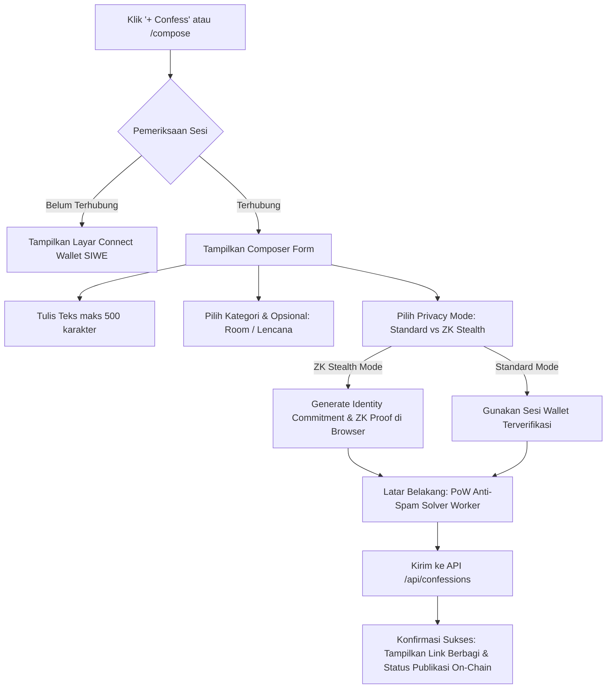

# Confession Booth (UNSAID) — UI/UX Redesign Specification & Design System Blueprint

> **Status:** Draft v2.0 (Design Blueprint Phase — Ready for Review)  
> **Source of Truth:** `docs/PRD.md`, `ARCHITECTURE.md`, `PRODUCT_COPY.md`, `MODERATION.md`, `PRIVACY.md`, `TASKS.md`  
> **Target Framework:** Next.js 16 (App Router), React 19, Tailwind CSS v3.4, shadcn/ui, Radix UI Primitives, Lucide Icons  
> **Rule:** _Blueprint only — zero code modifications during this phase._

---

## 1. Design Goals

### 1.1 Tujuan Redesign

Confession Booth (UNSAID) adalah platform pengakuan anonim terdesentralisasi di mana ekspresi emosional pengguna dilindungi secara kriptografis dan diverifikasi di blockchain tanpa mengekspos identitas wallet di ruang publik.

Tujuan utama dari full redesign ini adalah mentransformasikan antarmuka dari prototipe fungsional yang kaku menjadi **suaka digital (digital sanctuary) yang intim, tenang, misterius, berwibawa, sangat responsif, dan mudah diakses (WCAG 2.2 AA)**.

### 1.2 Masalah UI/UX Existing

1. **Visual Flatness & Kurang Kedalaman:**
   - Palet warna saat ini hanya mengandalkan background `#0b0b10` solid dan border tipis `#262631` tanpa tata cahaya, tanpa variasi tekstur mikro, dan tanpa elevasi optis yang membedakan hierarki informasi.
2. **Komposisi Komponen Monolitik:**
   - File seperti `composer.tsx` mencapai ~600 baris kode yang mencampuradukkan form teks, selektor room, selektor badge, ZK proof identity worker, PoW hashing, dan modal pelaporan tanpa pembagian sub-komponen shadcn yang terstandarisasi.
3. **Kurangnya Feedback Interaktif & State Transisi:**
   - Reaksi dan interaksi copy link terasa statis tanpa transisi pegas (spring physics) atau visual feedback instan.
   - Belum ada sistem Toast notification universal (seperti Sonner); error ditampilkan dengan teks merah mentah di bawah input.
4. **Alur Form yang Mengintimidasi pada Fitur Privasi:**
   - Opsi _ZK Stealth Mode_ (Zero-Knowledge Anonymous Proof) sangat kuat secara teknis, namun saat ini membingungkan bagi pengguna awam karena tidak ada _step-by-step visual stepper_ yang menjelaskan proses komputasi bukti.
5. **Hierarki Typografi Terbatas:**
   - Tipografi hanya menggunakan font sans-serif standar browser tanpa kontras ritme editorial (belum memanfaatkan font display berkarakter, penyesuaian letter-spacing, maupun angka tabular untuk on-chain hashes).
6. **Inkonsistensi Navigasi & Aksi Mobile:**
   - Menu drawer mobile masih berupa dropdown sederhana tanpa animasi drawer/sheet sheet yang mulus dan belum ramah penggunaan satu tangan (_thumb-zone friendly_).

### 1.3 Target Hasil Redesign

- **Estetika Digital Sanctuary:** Menghadirkan atmosfer lilin temaram (_quiet candlelight aesthetic_), aksen violet-lavender lembut yang terkalibrasi, permukaan glassmorphism halus dengan batas refraksi 1px.
- **Standar shadcn/ui Resmi:** Menerapkan arsitektur komponen shadcn/ui berbasis token semantik (`bg-card`, `text-muted-foreground`, `ring-offset-background`, dll.) tanpa kelas styling ad-hoc.
- **Interaksi Sentuhan & Mikro-Animasi:** Feedback sentuhan responsif (`scale(0.98)` pada tombol, transisi 200–300ms, animasi bara reaksi).
- **Kejelasan Alur Privasi:** Alur posting ZK yang transparan dan meyakinkan dengan visualisasi proses komputasi yang informatif.

### 1.4 Prinsip Desain

1. **Sanctuary of Truth (Suaka Kejujuran):** Desain harus terasa aman, privat, bebas gangguan, dan tidak menyerupai media sosial berbasis algoritma engagement yang bising.
2. **Honest Cryptographic Privacy (Privasi Jujur):** Jangan membuat klaim berlebihan ("100% anonim"). Tampilkan status verifikasi (Session vs ZK) dengan representasi visual yang jujur dan edukatif.
3. **Tactile Empathy (Empati Taktil):** Setiap reaksi dan whisper harus terasa bermakna melalui visual micro-feedback yang hangat.
4. **Accessible by Default:** Kontras warna memenuhi rasio minimum 4.5:1 (teks normal) dan 3:1 (komponen antarmuka), fokus keyboard terlihat jelas, dan target sentuh minimal 44×44px.

---

## 2. Product & User Understanding

### 2.1 Tujuan & Fungsi Utama Website

- **Tempat Mengeluarkan Isi Hati:** Menuliskan rahasia, penyesalan, cinta tak terbalas, atau kelelahan hidup tanpa takut dihakimi atau dikaitkan dengan profil sosial/wallet.
- **Eksplorasi Empati Publik:** Membaca pengakuan orang lain, memberikan reaksi emosional (_I Understand, Sending Love, I Feel This, That's Wild, I Shouldn't Laugh_), dan mengirimkan pesan bisikan (_whisper_).
- **Verifikasi Kekal Tanpa Plaintext:** Setiap pengakuan ditandai dengan content-hash di blockchain Ethereum Sepolia sehingga terbukti autentik tanpa mengekspos plaintext ke buku besar on-chain.
- **Community Rooms:** Ruang percakapan bertema terkurasi (misal: `#career`, `#relationships`, `#late-night`, `#family`).

### 2.2 Target Pengguna

1. **The Confessor (Pemberi Pengakuan):** Membutuhkan kelegaan emosional, menuntut privasi tanpa celah, menginginkan kepastian bahwa identitas wallet tidak akan bocor.
2. **The Empathetic Listener (Pendengar/Pembaca):** Datang untuk membaca kisah nyata, mencari perasaan senasib (_relatable_), meninggalkan reaksi hangat atau whisper penguat.
3. **The Web3 Privacy Enthusiast:** Mengapresiasi teknologi Zero-Knowledge proofs, desentralisasi, verifikasi hash on-chain, dan transparansi kode.
4. **The Community Moderator:** Menjaga kebersihan booth dari konten berbahaya (doxxing, spam, ujaran kebencian) dengan dashboard yang efisien dan objektif.

### 2.3 User Pain Points (Existing)

- Pengguna ragu apakah postingan mereka benar-benar aman jika dompet (wallet) terhubung.
- Proses penghitungan Proof-of-Work (PoW) anti-spam dan pembuatan ZK proof terkadang terasa seperti aplikasi mengalami freeze karena ketiadaan indikator animasi stepper yang jelas.
- Alur balasan whisper panjang sulit dibaca secara hierarkis di perangkat mobile.

---

## 3. Information Architecture

### 3.1 Sitemap & Struktur Halaman

```text
Confession Booth (UNSAID)
├── / (Landing Page / The Sanctuary Entrance)
├── /feed (Public Confession Feed — Newest)
├── /trending (Algorithmic Trending Feed — Engagement Decay)
├── /relatable (Empathy Feed — "I Understand" Weighted)
├── /midnight (Midnight Feed — Filter Waktu Khusus 00:00 - 04:00)
├── /rooms (Community Rooms Directory)
│   └── /rooms/[slug] (Room Filtered Feed)
├── /compose (The Booth Composer — Standard & ZK Stealth)
├── /confessions/[publicId] (Confession Detail, Whisper Threads, Proof Inspector)
├── /settings (Session Management, Badges, ZK Identity Setup)
├── /guidelines (Community Guidelines & Ethics)
├── /privacy (Privacy Reality & Cryptographic Limits)
├── /mod (Moderation Dashboard — MODERATOR / ADMIN Role)
└── /admin (System Bootstrap & Role Management — ADMIN Role)
```

### 3.2 Hierarki Navigasi

- **Primary Navigation (Desktop Header):**
  - Logo & Brand Mark (`/`)
  - Feed (`/feed`)
  - Rooms (`/rooms` dengan badge jumlah room aktif)
  - Trending (`/trending`)
  - Midnight (`/midnight` dengan indikator status aktif malam)
  - Action Button: **`+ Confess`** (Primary Accent Pill)
  - User Session / Identity Badge (Status koneksi, tombol Connect / Profil Popover)
- **Secondary Navigation (Footer):**
  - Legal & Prinsip: Guidelines (`/guidelines`), Privacy Notice (`/privacy`), On-Chain Contract Link
  - Utilitas: Session & Badges (`/settings`), Status Node & Chain Health
- **Mobile Navigation:**
  - Top Bar: Brand Mark + Quick Confess Pill + Hamburger Button
  - Mobile Slide-over Sheet / Bottom Drawer: Navigasi penuh, status sesi wallet, switcher mode, dan link panduan.

---

## 4. User Flow

### 4.1 Flow: Membaca & Merespons (First Visit to Engagement)

```mermaid
graph TD
    A[Visitor membuka /] --> B[Hero: Pesan Intim & Tombol 'Enter the Booth']
    B --> C[Halaman /feed Publik]
    C --> D{Interaksi Pengguna}
    D -->|Klik Reaksi Lilin/Hati| E{Sudah Login?}
    E -->|Belum| F[Modal Connect Wallet & SIWE]
    E -->|Sudah| G[Reaksi Bertambah - Optimistic UI]
    D -->|Buka Detail| H[/confessions/publicId]
    H --> I[Baca Thread Whisper & Cek Proof On-chain]
```

### 4.2 Flow: Menulis Pengakuan (Confessing Flow)



---

## 5. Layout & Visual Hierarchy

### 5.1 Struktur Kontainer & Dimensi

- **Desktop Max-Width:** `max-w-4xl` (896px) untuk feed dan konten umum; `max-w-3xl` (768px) untuk halaman detail dan composer untuk kenyamanan membaca optimal (~65–75 karakter per baris).
- **Grid System:**
  - Feed & List: Single-column stream dengan jarak visual `gap-5` (20px).
  - Directory (Rooms & Badges): 2-kolom responsif (`grid-cols-1 md:grid-cols-2 gap-4`).
- **Header:** Sticky header setinggi `h-16` (64px) dengan `backdrop-blur-md` dan batas refraksi `border-b border-border/50`.
- **Footer:** Padding vertikal luas (`py-12`) dengan tipografi muted yang tenang.

### 5.2 Tata Letak Kartu Pengakuan (Confession Card Layout)

```text
+-------------------------------------------------------------------------+
| [Author: Anonymous #1234]  [Shield: ZK]  [Badge: Empathetic]   [#career] [2h ago] |
|-------------------------------------------------------------------------|
| "Saya selalu merasa bersalah karena tidak pernah benar-benar mencintai  |
| pekerjaan ini, padahal keluarga saya mengorbankan segalanya..."        |
|-------------------------------------------------------------------------|
| [🕯️ 24] [❤️ 12] [😭 5] [💀 2] [😂 0]       [💬 8 Whispers]   [🔗 Share] [🚩] |
+-------------------------------------------------------------------------+
```

---

## 6. Visual Design System

### 6.1 Palet Warna (Color System)

Menerapkan skema warna HSL Dark Mode eksklusif yang dirancang khusus untuk kenyamanan membaca di malam hari (_candlelight ambient_):

| Token Semantik             | HSL Value     | Hex Approx | Fungsi UI                               |
| :------------------------- | :------------ | :--------- | :-------------------------------------- |
| `--background`             | `240 10% 4%`  | `#09090d`  | Latar belakang dasar aplikasi           |
| `--card`                   | `240 10% 7%`  | `#111117`  | Permukaan kartu pengakuan & panel utama |
| `--card-foreground`        | `240 5% 94%`  | `#efedf4`  | Teks utama di atas kartu                |
| `--popover`                | `240 10% 8%`  | `#14141d`  | Modal, dropdown, dan tooltip            |
| `--popover-foreground`     | `240 5% 94%`  | `#efedf4`  | Teks di dalam popover                   |
| `--primary`                | `265 90% 78%` | `#c4a1ff`  | Warna aksen utama (lilin ungu lavender) |
| `--primary-foreground`     | `240 10% 4%`  | `#09090d`  | Teks di atas warna primary              |
| `--secondary`              | `240 8% 14%`  | `#22222d`  | Permukaan sekunder, badge netral        |
| `--secondary-foreground`   | `240 5% 85%`  | `#dad6e5`  | Teks sekunder                           |
| `--muted`                  | `240 8% 12%`  | `#1c1c26`  | Latar tombol pasif & skeleton           |
| `--muted-foreground`       | `240 5% 65%`  | `#a5a1b8`  | Teks sekunder, timestamp, caption       |
| `--accent`                 | `265 60% 25%` | `#382657`  | Hover state lembut & highlight          |
| `--accent-foreground`      | `265 90% 85%` | `#d9c4ff`  | Teks di atas accent                     |
| `--destructive`            | `0 72% 51%`   | `#dc3545`  | Indikator error, tombol ban/hapus       |
| `--destructive-foreground` | `0 0% 100%`   | `#ffffff`  | Teks tombol destructive                 |
| `--border`                 | `240 8% 16%`  | `#262633`  | Garis batas struktural kartu & pemisah  |
| `--ring`                   | `265 90% 78%` | `#c4a1ff`  | Indikator fokus aksesibilitas keyboard  |

### 6.2 Tipografi

- **Font Display (Headings & Hero):** `Outfit` atau `Geist Sans` dengan pelacakan huruf (_letter-spacing_) ketat (`tracking-tight`) untuk memberi bobot yang kuat dan tenang.
- **Font Body (Isi Pengakuan & Teks Panjang):** `Geist Sans` atau `Inter` dengan `leading-relaxed` (line-height: 1.65) untuk keterbacaan tinggi.
- **Font Monospace (Hashes, Proof, Timestamp On-Chain):** `Geist Mono` atau `JetBrains Mono` dengan fitur `font-variant-numeric: tabular-nums`.

#### Skala Tipografi:

- **Display 1 (Hero Title):** `text-4xl md:text-5xl font-bold tracking-tight`
- **Heading 1 (Page Title):** `text-2xl md:text-3xl font-semibold tracking-tight`
- **Heading 2 (Section Title):** `text-xl font-semibold tracking-normal`
- **Body Large (Confession Card Body):** `text-base md:text-lg leading-relaxed font-normal`
- **Body Regular (Standard UI & Form):** `text-sm leading-normal`
- **Caption / Meta (Timestamps, Labels, Badges):** `text-xs font-medium tracking-wide`
- **Micro (Hash & On-Chain Indicators):** `text-[11px] font-mono`

### 6.3 Radius & Elevasi (Corner Radius & Shadows)

- `--radius-sm`: `0.375rem` (6px) — untuk badge kecil & tag inline.
- `--radius-md`: `0.5rem` (8px) — untuk tombol, input, dan dropdown.
- `--radius-lg`: `0.75rem` (12px) — untuk kartu modul & dialog form.
- `--radius-xl`: `1rem` (16px) — untuk kartu pengakuan (`booth-card`).
- `--radius-full`: `9999px` — untuk pil filter kategori dan tombol aksi utama.

- **Shadow & Depth:** Menggunakan bayangan dengan rona warna gelap terintegrasi (bukan hitam pekat):
  - `shadow-sm`: `0 1px 2px 0 rgba(9, 9, 13, 0.4)`
  - `shadow-card`: `0 4px 20px -2px rgba(9, 9, 13, 0.6), 0 0 0 1px rgba(196, 161, 255, 0.05)`
  - `shadow-glow`: `0 0 25px -5px rgba(196, 161, 255, 0.15)`

### 6.4 Iconography & Brand Assets

Aplikasi kini memiliki aset identitas visual resmi yang telah terintegrasi di `apps/web/app/`:

1. **Brand Mark SVG (`apps/web/app/icon.svg`):**
   - **Konsep:** Nyala api lilin bergradasi lavender-violet (`#f2ecff` -> `#9b6ff0` -> `#5b2fae`) dengan siluet lubang kunci (_keyhole_) di tengahnya di atas latar sanctuary gelap.
   - **Makna Filosofis:** Melambangkan _sebuah kebenaran suci yang dijaga dalam kerahasiaan dan enkripsi kriptografis penuh_ (_a truth held in guarded privacy_).
   - **Penggunaan UI:** Menggantikan emoji lilin mentah (`🕯️`) pada `HeaderNav`, brand mark kartu selamat datang, dan favicon vector resolusi tinggi.
2. **Favicon Browser (`apps/web/app/favicon.ico`):**
   - Format standar multi-size untuk tab browser desktop.
3. **Apple Touch Icon (`apps/web/app/apple-icon.png`):**
   - Touch icon resolusi tinggi untuk bookmark homescreen iOS / iPadOS dan bookmark mobile PWA.
4. **UI System Icons (`lucide-react`):**
   - Digunakan untuk kontrol aksi antarmuka secara konsisten dengan aturan shadcn `data-icon` (mis. `ShieldCheck`, `MessageCircle`, `Share2`, `Flag`, `Lock`, `Check`).

---

## 7. shadcn/ui Component Strategy

### 7.1 Daftar Komponen yang Digunakan

Sesuai dengan skill `shadcn`, seluruh elemen antarmuka dibangun di atas komponen resmi shadcn/ui:

| Komponen shadcn/ui                                                | Peran dalam Aplikasi                                                |
| :---------------------------------------------------------------- | :------------------------------------------------------------------ |
| `Button`                                                          | Tombol utama, filter kategori, aksi reaksi, tombol kirim            |
| `Card` (`CardHeader`, `CardTitle`, `CardContent`, `CardFooter`)   | Fondasi seluruh kartu confession, room, dan modul info              |
| `Badge`                                                           | Tag kategori, status ZK proof, badge reputasi, OP indicator         |
| `Dialog` (`DialogContent`, `DialogHeader`, `DialogTitle`)         | Modal laporan pelanggaran (ReportModal), Modal bukti on-chain       |
| `Sheet` (`SheetContent`, `SheetHeader`, `SheetTitle`)             | Menu navigasi drawer mobile, detail whisper samping                 |
| `Tabs` (`TabsList`, `TabsTrigger`, `TabsContent`)                 | Pemilah feed (New, Trending, Relatable, Midnight)                   |
| `Textarea`                                                        | Area penulisan confession dan whisper reply                         |
| `Input`                                                           | Input detail laporan, input search room, input wallet address admin |
| `Tooltip` (`TooltipProvider`, `TooltipTrigger`, `TooltipContent`) | Penjelasan arti lencana, status bukti kriptografi, indikator PoW    |
| `DropdownMenu`                                                    | Menu opsi pengguna, filter sorting tambahan, aksi moderasi          |
| `Separator`                                                       | Garis pemisah konten horizontal/vertikal                            |
| `Skeleton`                                                        | Placeholder loading seragam untuk kartu dan daftar feed             |
| `Empty` / Custom Empty Layout                                     | Tampilan saat feed/whisper kosong (_The booth is quiet_)            |
| `Sonner` (`toast`)                                                | Sistem notifikasi toast universal untuk keberhasilan/kegagalan      |

---

## 8. Component Consistency

### 8.1 Tombol (Button)

- **Default / Primary:** `bg-primary text-primary-foreground hover:bg-primary/90 font-medium rounded-full shadow-sm`
- **Secondary / Neutral:** `bg-secondary text-secondary-foreground hover:bg-secondary/80 rounded-full`
- **Ghost / Reaction:** `hover:bg-accent/40 text-muted-foreground hover:text-foreground rounded-full border border-border/60`
- **Destructive:** `bg-destructive/15 text-destructive border border-destructive/30 hover:bg-destructive/25 rounded-md`
- **Ukuran:** `size="sm"` (h-8 px-3 text-xs), `size="default"` (h-10 px-4 text-sm), `size="lg"` (h-12 px-6 text-base).

### 8.2 Badge

- Menggunakan semantik warna yang konsisten:
  - **Kategori Feed:** `variant="outline"` dengan `bg-muted/30 text-muted-foreground border-border`
  - **ZK Stealth Proof:** `border-emerald-500/30 bg-emerald-500/10 text-emerald-400 font-mono`
  - **OP (Original Poster):** `border-primary/40 bg-primary/10 text-primary font-semibold`
  - **Lencana Komunitas:** Mengikuti palet khusus per tipe badge (Amber untuk Empathetic Listener, Violet untuk Midnight Walker, Indigo untuk Deep Soul).

### 8.3 Form & Input

- Menggunakan standar shadcn `FieldGroup` dan `Field` dengan penanda validasi `data-invalid` dan `aria-invalid`.
- Indikator penghitung karakter teks (misal `482/500`) ditempatkan rapi di pojok kanan bawah textarea dengan perubahan warna progresif (kuning saat >450, merah saat >500).

---

## 9. Responsive Design

### 9.1 Breakpoint Strategy

- **Mobile (<640px - `sm`):**
  - Padding kontainer utama `px-4`.
  - Navigasi desktop disembunyikan; tombol `+ Confess` ringkas tetap terlihat di sebelah tombol hamburger.
  - Kartu pengakuan menggunakan layout vertikal rapat, tombol aksi diperlebar untuk target sentuh optimal.
  - Baris reaksi dapat digeser horizontal (_horizontal scroll_) jika melebihi lebar layar.
- **Tablet (640px - 1024px - `md`):**
  - Grid komunitas room beralih ke 2 kolom.
  - Header menampilkan tab navigasi lengkap.
- **Desktop (>1024px - `lg`):**
  - Lebar kartu terpusat rapi dengan ruang napas putih/gelap (_whitespace_) yang seimbang.
  - Floating action pill atau quick shortcuts dapat diaktifkan.

---

## 10. Accessibility (WCAG 2.2 AA)

1. **Focus Rings:** Semua kontrol interaktif memiliki `:focus-visible` dengan `outline: 2px solid hsl(var(--primary))` dan `outline-offset: 2px`.
2. **Accessible Contrast:** Rasio kontras teks utama (`#efedf4` di atas `#111117`) mencapai **13.5:1**, jauh melampaui batas minimum WCAG 4.5:1.
3. **Screen Reader Optimization:**
   - Semua tombol emoji memiliki `aria-label` deskriptif (contoh: `aria-label="24 orang memahami pengakuan ini"`).
   - Simbol visual lilin dan ikon dekoratif ditandai dengan `aria-hidden="true"`.
   - Skip-link ke konten utama tersedia di bagian paling atas HTML (`#main`).
4. **Reduced Motion:** Mendukung `@media (prefers-reduced-motion: reduce)` dengan menonaktifkan animasi transform/scale yang intens.

---

## 11. UX Performance

1. **Skeleton Loaders Geometris:** Mengganti animasi loading spinner standar dengan `Skeleton` yang bentuk, tinggi, dan tata letaknya identik dengan kartu pengakuan asli untuk menghilangkan _Cumulative Layout Shift (CLS)_.
2. **Optimistic UI:**
   - Reaksi bertambah secara instan (+1) saat diklik di browser, lalu melakukan sinkronisasi di latar belakang. Jika jaringan gagal, status dikembalikan dan toast notifikasi muncul.
   - Whisper reply langsung ter-render di daftar balasan seketika sebelum respon API selesai.
3. **Paginasi Load More Berkelanjutan:** Tombol "Load More" yang elegan menggantikan tombol paginasi konvensional, menjaga posisi scroll pengguna tetap stabil.

---

## 12. Component States

Setiap komponen interaktif wajib mengimplementasikan 8 state berikut:

1. **Default:** Tampilan awal yang tenang dan terbaca jelas.
2. **Hover:** Perubahan warna permukaan (`bg-accent/30`) dan garis batas halus dalam durasi 200ms.
3. **Focus:** Focus ring ungu terang dengan offset 2px.
4. **Active / Pressed:** Efek mikro-penekanan `transform: scale(0.98)`.
5. **Selected:** Penanda visual aktif (border tebal atau pill aksen).
6. **Disabled:** Opacity 50% dengan kursor `not-allowed`.
7. **Loading:** Tombol menampilkan spinner inline halus tanpa mengubah ukuran tombol.
8. **Empty State:** Ilustrasi lilin temaram dengan salinan teks puitis (_"The booth is quiet."_).

---

## 13. Animation & Interaction

- **Durasi Standar:** `200ms` untuk interaksi mikro; `300ms` untuk transisi drawer & modal.
- **Easing:** `cubic-bezier(0.16, 1, 0.3, 1)` (spring-like deceleration yang halus).
- **Candle Flicker:** Efek cahaya lilin bernapas (_breathing ambient pulse_) halus di landing page hero.
- **Copy Success:** Animasi transisi instan dari ikon tautan `🔗` ke tanda centang `✓` dengan feedback toast dari Sonner.

---

## 14. Page-by-Page Redesign Specification

### 14.1 Landing Page (`/`)

- **Tujuan:** Menarik pengunjung masuk ke dalam atmosfer suaka pengakuan tanpa kewajiban menghubungkan wallet di awal.
- **Layout Baru:**
  ```text
  Header (Branding + Enter Button)
  ├── Hero Section (Candle Ambient Glow, Display Headline, Puitis Subheader, Primary CTA Pill)
  ├── Live Snapshot Preview (3 kartu pengakuan terbaru terkurasi dengan efek fade-out bawah)
  ├── How It Works Grid (3 kartu bento asimetris: 1. Masuk Anonim, 2. Ekspresi Bebas, 3. Verifikasi Blockchain)
  ├── Empathy Manifesto (Pernyataan keterbatasan kriptografi & perlindungan privasi yang jujur)
  └── Footer Minimalis
  ```

### 14.2 Feed Utama (`/feed`, `/trending`, `/relatable`, `/midnight`)

- **Tujuan:** Pusat penjelajahan pengakuan publik.
- **Perbaikan:**
  - Mengganti navigasi tab terpisah menjadi **Segmented Tabs bar** yang terpadu di bagian atas feed.
  - Penambahan filter cepat berdasarkan Room dan Kategori dengan pill geser horizontal.
  - Kartu confession didesain ulang dengan hierarki metadata yang lebih rapi, tombol reaksi dengan angka jelas, dan tombol share terintegrasi.
  - Banner dinamis pada `/midnight` yang mengindikasikan status jam malam (aktif jam 00:00 - 04:00).

### 14.3 Halaman Composer (`/compose`)

- **Tujuan:** Suaka penulisan pengakuan yang bebas distorsi.
- **Perbaikan:**
  - Pemecahan arsitektur komponen menjadi beberapa modul: `ComposerEditor`, `PrivacyModeSelector`, `RoomBadgePicker`, dan `ZkProofProgressDialog`.
  - Mode Switcher yang intuitif:
    - **Standard Mode (Sesi Wallet):** Cepat, mudah, menggunakan signature wallet SIWE.
    - **ZK Stealth Mode (Zero-Knowledge):** Membuka panel stepper visual yang menjelaskan pembuatan identitas anonim, pembuktian komitmen Merkle root, dan eksekusi bukti tanpa tautan ke address asal.
  - Live character counter melingkar (_circular progress_) di sebelah tombol kirim.

### 14.4 Halaman Detail Confession & Whispers (`/confessions/[publicId]`)

- **Tujuan:** Ruang mendalam untuk membaca satu pengakuan, mengecek bukti on-chain, dan berdiskusi lewat bisikan (_whisper_).
- **Perbaikan:**
  - Kartu pengakuan utama diberi sorotan visual (_elevated prominence_).
  - Bagian **Cryptographic Proof Inspector** dapat di-expand (_accordion_) menampilkan On-Chain Transaction Hash, Merkle Root, Block Number, dan link langsung ke Block Explorer Sepolia.
  - Thread whisper menggunakan indentasi percakapan bersarang dengan penanda lencana **OP** (Original Poster) yang kontras.
  - Form whisper balasan tersemat rapi di bagian bawah thread dengan target reply yang jelas.

### 14.5 Direktori & Halaman Room (`/rooms` & `/rooms/[slug]`)

- **Tujuan:** Ruang tematik terkurasi untuk komunitas.
- **Perbaikan:**
  - Tampilan kartu room modern dengan ikon tema, jumlah partisipan aktif, dan deskripsi tujuan ruang.
  - Halaman room individual dilengkapi banner tematik dan tombol pintas untuk langsung menulis ke room tersebut.

### 14.6 Halaman Pengaturan & Lencana (`/settings`)

- **Tujuan:** Manajemen sesi wallet, pendaftaran ZK Anonymous Commitment, dan galeri lencana reputasi yang diperoleh.
- **Perbaikan:**
  - Kartu status sesi: menampilkan alamat wallet pengguna (dipersingkat), jaringan saat ini, dan tombol putus koneksi (_Disconnect_).
  - ZK Identity Management: tombol satu-klik untuk mendaftarkan komitmen identitas anonim ke Merkle tree backend.
  - Galeri Badges: grid interaktif menampilkan lencana yang sudah diraih (_unlocked_) dan lencana yang masih terkunci (_locked_) beserta syarat pencapaiannya.

### 14.7 Halaman Moderasi & Admin (`/mod` & `/admin`)

- **Tujuan:** Alat kerja cepat dan akurat untuk moderator dan administrator.
- **Perbaikan:**
  - Antarmuka berbasis tabel/antrean bersih dengan filter status laporan (Open, Reviewing, Resolved).
  - Tombol aksi moderasi cepat (_Dismiss, Hide, Remove, Restrict, Ban_) dengan modal konfirmasi alasan.
  - Admin grant-role form yang ramah pengguna untuk mendaftarkan wallet moderator baru.

---

## 15. Component Inventory

### Komponen yang Dipertahankan & Ditingkatkan (Upgraded)

- `HeaderNav` -> Dirombak total menggunakan `Sheet` mobile dan navigasi desktop berbasis token.
- `BoothCard` -> Ditata ulang strukturnya dengan komposisi `Card`, `Badge`, dan `Tooltip`.
- `ComposerForm` -> Dipecah menjadi komponen modular dengan dialog stepper ZK proof.

### Komponen Baru yang Ditambahkan (New)

- `components/ui/*` (shadcn primitives): Button, Card, Badge, Dialog, Sheet, Tabs, Tooltip, DropdownMenu, Skeleton, Separator, Textarea, Input, Sonner.
- `components/proof-inspector.tsx`: Komponen khusus untuk inspeksi bukti kriptografi on-chain.
- `components/whisper-thread.tsx`: Komponen modular untuk rantai bisikan dan balasan OP.
- `components/zk-stepper.tsx`: Visual stepper indikator komputasi identitas Zero-Knowledge.
- `components/brand-mark.tsx`: Komponen SVG logo resmi (`icon.svg`) bernuansa lilin temaram dengan siluet lubang kunci, mendukung variasi ukuran (`sm`, `md`, `lg`) untuk header dan landing hero.
- `components/category-pills.tsx`: Bilah pill filter kategori horizontal yang fluid.

---

## 16. Design Tokens Reference

```css
/* apps/web/app/globals.css */
@layer base {
  :root {
    --background: 240 10% 4%;
    --foreground: 240 5% 94%;

    --card: 240 10% 7%;
    --card-foreground: 240 5% 94%;

    --popover: 240 10% 8%;
    --popover-foreground: 240 5% 94%;

    --primary: 265 90% 78%;
    --primary-foreground: 240 10% 4%;

    --secondary: 240 8% 14%;
    --secondary-foreground: 240 5% 85%;

    --muted: 240 8% 12%;
    --muted-foreground: 240 5% 65%;

    --accent: 265 60% 25%;
    --accent-foreground: 265 90% 85%;

    --destructive: 0 72% 51%;
    --destructive-foreground: 0 0% 100%;

    --border: 240 8% 16%;
    --input: 240 8% 16%;
    --ring: 265 90% 78%;

    --radius: 0.75rem;
  }
}
```

---

## 17. Implementation Guidelines (Panduan Tahap Berikutnya)

Ketika tahap implementasi disetujui, urutan pengerjaan harus mengikuti fase terstruktur berikut:

1. **Fase Fondasi & Primitives (Tahap 1):**
   - Menginisialisasi komponen dasar shadcn/ui di `apps/web/components/ui/` (`button`, `card`, `badge`, `dialog`, `sheet`, `tabs`, `tooltip`, `separator`, `skeleton`, `textarea`, `input`).
   - Memperbarui `globals.css` dan `tailwind.config.ts` dengan token semantik HSL di atas.
2. **Fase Layout & Navigasi (Tahap 2):**
   - Mengimplementasikan `HeaderNav` baru dengan Sheet mobile drawer.
   - Merapikan footer dan container global di `layout.tsx`.
3. **Fase Komponen Inti Feed (Tahap 3):**
   - Mentransformasikan `BoothCard` dan daftar Feed (`/feed`, `/trending`, `/relatable`, `/midnight`).
   - Mengintegrasikan Sonner toast provider untuk feedback reaksi dan copy tautan.
4. **Fase Detail & Rantai Whisper (Tahap 4):**
   - Mempercantik halaman `/confessions/[publicId]` dengan thread percakapan berjenjang dan `ProofInspector`.
5. **Fase Composer & ZK Stepper (Tahap 5):**
   - Memecah dan merombak `/compose` menjadi form bertahap yang bersih dengan visualisasi ZK progress.
6. **Fase Fitur Komunitas & Utilitas (Tahap 6):**
   - Memoles `/rooms`, `/settings`, `/mod`, `/admin`, `/guidelines`, `/privacy`, serta halaman `not-found` dan `error`.

> **Batasan Penting:** Seluruh fungsi API yang ada (`/api/feed`, `/api/confessions`, `/api/auth/*`, `/api/zk/*`, dll.) dan penanganan sesi tidak boleh diubah kontraknya. Redesign hanya menyentuh visual presentation, usability flow, dan komponen presentasional.

---

## 18. Redesign Verification Checklist

Dokumen ini akan digunakan sebagai kriteria evaluasi setelah implementasi selesai:

- [ ] **Desain & Estetika:** Tampilan memiliki rona gelap sanctuary yang elegan tanpa warna mencolok yang bertabrakan.
- [ ] **Konsistensi shadcn/ui:** Semua tombol, kartu, dialog, dan input menggunakan komponen shadcn/ui.
- [ ] **Responsif Mobile:** Seluruh halaman nyaman digunakan di layar ponsel (<400px), tombol hamburger dan drawer berfungsi mulus.
- [ ] **Aksesibilitas (A11y):** Kontras warna lulus uji WCAG AA, focus ring terlihat jelas saat navigasi tab keyboard, screen reader memiliki label yang memadai.
- [ ] **Feedback Interaktif:** Toast notifikasi muncul saat tautan disalin atau terjadi galat; tombol memiliki state loading saat menunggu jaringan.
- [ ] **Integritas Fitur:** Semua fungsionalitas inti (SIWE Login, Confess Standard, Confess ZK Stealth, Reaksi, Whispers berbalas, Laporan Pelanggaran, dan Moderasi) berfungsi normal 100%.
- [ ] **Zero Cumulative Layout Shift:** Loading skeletons menampilkan dimensi yang presisi sesuai wujud kartu konten asli.
